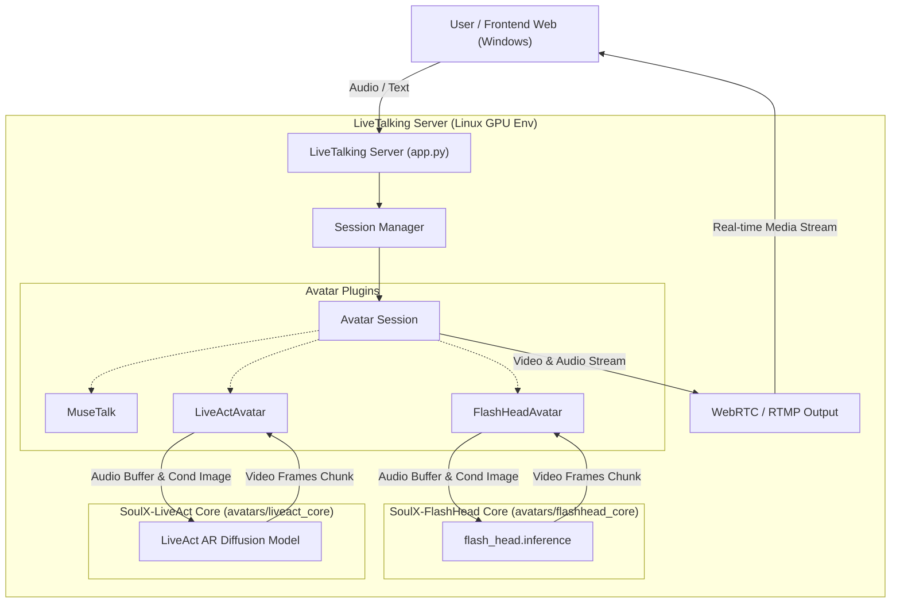
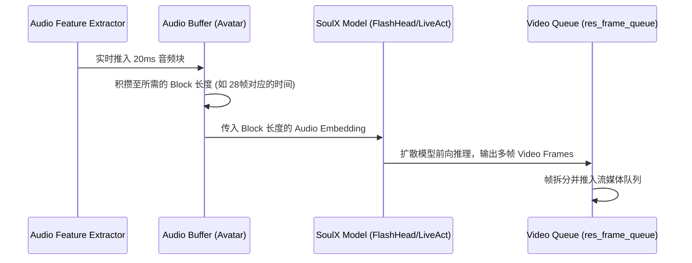

# DESIGN: LiveTalking SoulX Extension

## 1. 整体架构图

## 2. 分层设计和核心组件

### 2.1 目录融合设计 (复制融合策略)
为了使 LiveTalking 完全自包含这两个模型，将它们的核心目录迁移到 `LiveTalking/avatars/` 中：
- `SoulX-FlashHead/flash_head/` -> `LiveTalking/avatars/flashhead_core/flash_head/`
- `SoulX-LiveAct/` 核心代码 -> `LiveTalking/avatars/liveact_core/` (包含 `wan`, `model_liveact`, `src`, `fp8_gemm.py`, `util_liveact.py` 等)

### 2.2 接口契约定义 (Avatar Wrapper)
根据 `LiveTalking` 的插件规范，每个 Avatar 需要实现以下接口：
- `load_model(opt)`: 加载全局模型权重到显存。
- `load_avatar(avatar_id)`: 加载特定数字人的素材（条件图、初始状态等）。
- `warm_up(batch_size, model)`: 模型预热。
- `class XXXAvatar(BaseAvatar)`:
  - 继承自 `BaseAvatar`。
  - 重写 `inference(self, quit_event)` 或者内部的数据流逻辑。因为原始 `BaseAvatar` 是基于每帧特征推理的，而 `FlashHead` 和 `LiveAct` 均是基于音频块（chunk/block）进行推理的，因此需要重写一个自定义的消费 `self.asr.feat_queue` 并进行块推理的主循环。

### 2.3 数据流向图

## 3. 异常处理策略
- 缓存区未满时：继续等待音频输入。若此时必须输出视频帧（例如系统要求严格的 25 FPS 恒定帧率输出），在模型推理耗时较大或缓冲不足时，可能需要复用上一帧或等待。
- GPU OOM：在 `liveact_avatar.py` 初始化时允许设置 `--block_offload` 和 `--fp8_kv_cache` 机制。

## 4. 复用现有组件
- 保持 `LiveTalking` 的 WebRTC, RTMP 流出逻辑不变。
- 保持 `LiveTalking` 的 LLM, TTS 处理流程不变。
