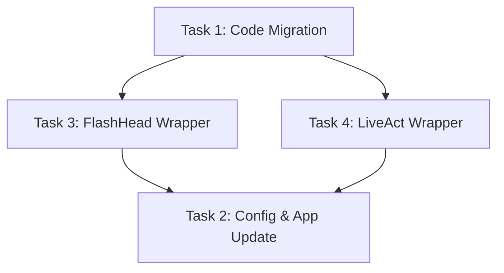

# TASK: LiveTalking SoulX Extension

## 任务拆分与依赖关系

### 1. Task_1_Code_Migration: 核心代码复制融合
- **输入契约**: 现有的 `SoulX-FlashHead` 和 `SoulX-LiveAct` 项目代码。
- **输出契约**: 将核心代码成功拷贝至 `LiveTalking/avatars/flashhead_core/` 和 `LiveTalking/avatars/liveact_core/`，并处理可能的相对引用导入路径。
- **验收标准**: 复制完成后，能够在 `LiveTalking/avatars` 目录下找到完整依赖，没有遗漏关键文件。

### 2. Task_2_Config_App_Update: 升级 LiveTalking 配置与主入口
- **输入契约**: `LiveTalking/config.py` 和 `LiveTalking/app.py`。
- **输出契约**: 
  - 在 `config.py` 的 `--model` 中增加 `flashhead` 和 `liveact` 选项，并添加相关的权重路径配置参数。
  - 在 `app.py` 的 `_avatar_modules` 字典中注册对应的 avatar 模块，并编写初始化时的加载逻辑。
- **验收标准**: 配置代码修改无语法错误。

### 3. Task_3_FlashHead_Wrapper: 实现 FlashHead Avatar 插件
- **输入契约**: `LiveTalking/avatars/flashhead_core/` 提供的模型功能。
- **输出契约**: `LiveTalking/avatars/flashhead_avatar.py`，其中包含 `@register("avatar", "flashhead")` 装饰的 `FlashHeadAvatar` 类，并实现 `load_model`, `load_avatar`, `warm_up` 以及处理流式缓冲推理的逻辑。
- **验收标准**: 插件符合 `BaseAvatar` 的架构接口，逻辑自洽，无语法错误。

### 4. Task_4_LiveAct_Wrapper: 实现 LiveAct Avatar 插件
- **输入契约**: `LiveTalking/avatars/liveact_core/` 提供的模型功能。
- **输出契约**: `LiveTalking/avatars/liveact_avatar.py`，其中包含 `@register("avatar", "liveact")` 装饰的 `LiveActAvatar` 类，并实现 AR Diffusion 的 `kv_cache` 状态维护与流式生成逻辑。
- **验收标准**: 插件符合 `BaseAvatar` 的架构接口，并正确引入并初始化 WanModel 和各类依赖，逻辑自洽。

### 任务依赖图

